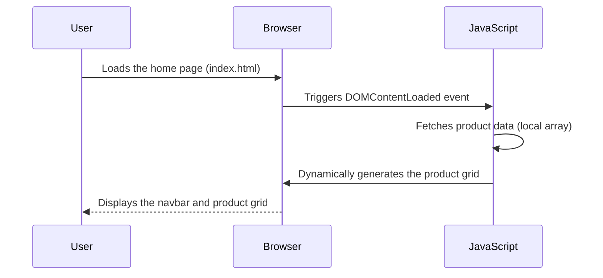

# Feature Sequence Diagram: Home Page

## Feature Description

The **Home Page** serves as the main landing page of the website. It includes:

1. A **Navbar** that provides links to different pages of the site
2. A **Product Grid** that dynamically displays a collection of products with their image, name, and price using a JS script for the product grid

---

## Sequence Diagram

