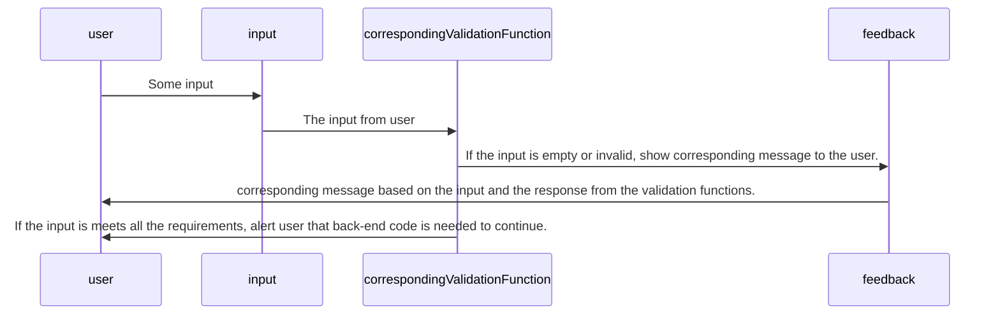

I designed and implemented everything on the sign in/up page of the UKart program except for the navbar which was provided by other teammates and I just modified it a bit so it matches my page and displays correctly. One of the features that I worked on during this milestone was, the sign in/up form which would show the sign in form by default but the user can use the toggle provided to switch to the sign up form. In the sign in form there is username, password, and sign in button. And in the sign up form there is confirm password, Venmo ID, Phone number, and email in addition to that(this form has a sign up button instead of sign in). This form will validate user's entries in real-time and provides useful feedback specific for each one in order for the user to know what would be the requirements needed. After all of the inputs are as wanted, when the sign in/up button is pressed, the website will respond by an alert letting the user know that that usage has not been implemented yet as it requires back-end coding.

